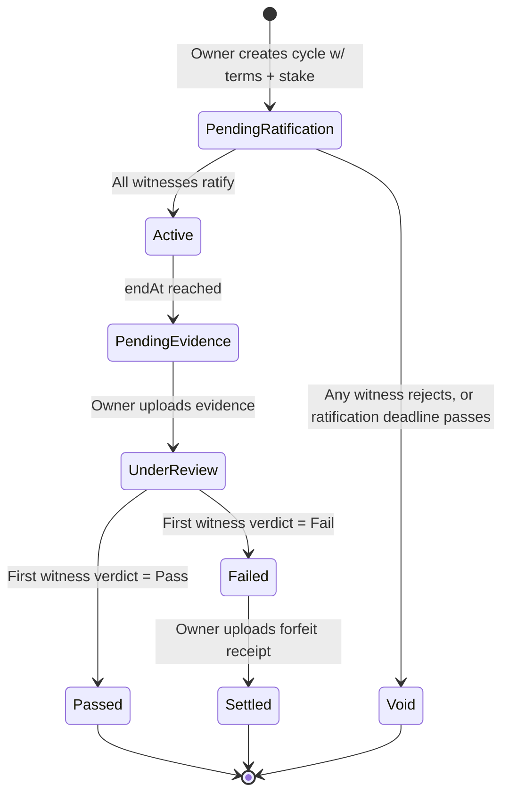

# Betty — Design & Implementation Doc

**Status:** MVP scoping · **Platform:** iOS (Expo/React Native) · **Owner:** Barry

## 1. Concept

Betty turns a personal commitment ("keep screen time under 5 hrs/day this week") into a social contract with real (if honor-system) stakes. A user creates a **Pact** with friends acting as **Witnesses**, agrees on **Terms** and a **Stake**, and at the end of the period submits **Evidence**. Witnesses render a **Verdict**. If the pact fails, the stake (a charity donation) is paid outside the app and proven with a receipt photo, itself witnessed.

No money moves through the app. No automated verification. Trust is enforced socially, by friends watching friends — that's the product, not a gap to fill later.

## 2. Glossary

| Term | Definition |
|---|---|
| **Pact** | The persistent container for a recurring commitment (e.g. "Barry's Screen Time Pact"). Owns identity, participants, and history across cycles. |
| **Cycle** | One dated instance of a Pact — this week's terms, this week's stake, this week's outcome. A Pact is repeated by creating a new Cycle, optionally with edited Terms. |
| **Witness** | A friend invited to a Pact who ratifies its Terms and later renders a Verdict on Evidence. Not an admin — has no power over the Pact except to approve/reject. |
| **Terms** | The rules and acceptance criteria for a Cycle, authored by the Pact owner (e.g. "average daily screen time, as shown in iOS Screen Time weekly report, must be under 5h00m"). |
| **Stake** | What's forfeited on failure (e.g. "$100 to American Red Cross"). Described in text; never custodied by the app. |
| **Ratification** | The step where every invited Witness reviews and approves a Cycle's Terms before it goes Active. |
| **Evidence** | A photo submitted as proof — a Screen Time screenshot for the primary outcome, a donation receipt for a failed Cycle's settlement. |
| **Verdict** | A Witness's Pass/Fail call on submitted Evidence. |
| **Bet Type** | The pluggable definition of what a Cycle is about (`screentime` is the only Bet Type at MVP). Exists so future types (steps, reading, gym visits) don't require re-architecting Pacts. |

## 3. Core Flows

### 3.1 Create user
Sign in with Apple → profile created (display name, avatar optional) → lands on empty "Active Pacts" home.

### 3.2 Create a Pact
1. Owner picks a Bet Type (only `screentime` at MVP — screen selectable but locked to one option).
2. Owner writes Terms (free text + a structured threshold: metric, comparator, value — e.g. `avg daily screen time < 5h00m`) and a Stake description.
3. Owner sets the Cycle window (start/end date — defaults to "this week," editable).
4. Owner invites Witnesses via a shareable deep link (`betty://invite/<token>`), sent through iMessage/whatever the OS share sheet offers. No account needed to receive the link — opening it walks a new user through Sign in with Apple, then auto-joins them as a Witness on that Pact.
5. Cycle sits in **Pending Ratification** until every invited Witness approves. Any Witness can also reject (with an optional comment), which voids the Cycle and returns it to the owner for edits.

### 3.3 View active pacts (read-only list)
Home tab: cards for each Pact the user owns or witnesses, showing current Cycle status (Pending Ratification / Active / Pending Evidence / Under Review / Passed / Failed / Settled), a countdown to `endAt`, and Witness avatars with ratification/verdict state (pending vs. done, shown as a small status dot per person).

### 3.4 Submit evidence & get a verdict
1. At/after `endAt`, the Cycle moves to **Pending Evidence**; owner is prompted (and reminded) to upload a Screen Time screenshot.
2. Cycle moves to **Under Review**; all Witnesses are notified.
3. First Witness to open it renders a Verdict (Pass/Fail) against the stated Terms, with an optional comment. That Verdict is final for the Cycle — see §7 for why this is intentional at MVP.
4. **Pass** → Cycle closes. **Fail** → Cycle moves to **Failed**, owner is prompted to donate and upload a receipt photo as settlement Evidence, visible to all Witnesses; Cycle then closes as **Settled**.
5. From a closed Cycle, the owner can start a new Cycle on the same Pact, carrying forward or editing Terms/Stake/Witnesses. Back to §3.2 step 2 with prior Terms pre-filled.

## 4. Cycle State Machine



## 5. Architecture

| Layer | Choice | Notes |
|---|---|---|
| Client | Expo (SDK 57) + Expo Router | `app/` holds routes only, per project convention; everything else lives in `src/`. |
| Styling | NativeWind | Per project convention — no inline style objects. |
| Images | `expo-image` (display), `expo-image-picker` (capture/select), `expo-image-manipulator` (client-side compression before upload — keeps S3 cost and upload time down) | Never RN's built-in `<Image>`. |
| Auth | AWS Cognito via **AWS Amplify Gen 2**, Sign in with Apple as the only enabled provider at MVP | Cognito decouples identity from auth method — enabling email/password later is a console/config change, not a data migration. Client-side: `expo-apple-authentication` for the native prompt, federated into Cognito. |
| Data | DynamoDB, modeled via Amplify Gen 2's `defineData` schema (generates tables + a GraphQL API + owner/participant-scoped authorization rules) | Chosen over hand-rolled DynamoDB + API Gateway to cut MVP boilerplate; still same AWS free-tier services under the hood. Reassess if this ever needs to scale past friends-and-family usage. |
| Storage | S3 (via Amplify Storage) for Screen Time screenshots and receipt photos | Compress client-side first (see Images row). |
| Notifications | `expo-notifications` client-side for registration; a scheduled Lambda (EventBridge Scheduler) queries DynamoDB for who's due a nudge and POSTs to Expo's push API | No APNs certificate management needed — Expo's push service handles that, including for EAS-built production apps. |
| Secure local storage | `expo-secure-store` | For cached auth tokens/session, per project convention. |

### Data model (illustrative Amplify Gen 2 schema)

```ts
const schema = a.schema({
  User: a.model({
    displayName: a.string().required(),
    appleSub: a.string(),
    expoPushToken: a.string(),
  }).authorization(allow => [allow.owner()]),

  Pact: a.model({
    title: a.string().required(),
    betType: a.string().required(), // 'screentime' at MVP
    ownerId: a.id().required(),
    participants: a.hasMany('Participant', 'pactId'),
    cycles: a.hasMany('Cycle', 'pactId'),
  }),

  Participant: a.model({
    pactId: a.id().required(),
    userId: a.id().required(),
    role: a.enum(['owner', 'witness']),
    invitedAt: a.datetime(),
    joinedAt: a.datetime(),
    pact: a.belongsTo('Pact', 'pactId'),
  }),

  Cycle: a.model({
    pactId: a.id().required(),
    terms: a.string().required(),
    stakeDescription: a.string().required(),
    startAt: a.datetime().required(),
    endAt: a.datetime().required(),
    status: a.enum([
      'pendingRatification', 'active', 'pendingEvidence',
      'underReview', 'passed', 'failed', 'settled', 'void',
    ]),
    pact: a.belongsTo('Pact', 'pactId'),
    verdicts: a.hasMany('Verdict', 'cycleId'),
    evidence: a.hasMany('Evidence', 'cycleId'),
  }),

  Verdict: a.model({
    cycleId: a.id().required(),
    witnessId: a.id().required(),
    kind: a.enum(['ratification', 'review']),
    decision: a.enum(['approve', 'reject']),
    comment: a.string(),
    decidedAt: a.datetime(),
    cycle: a.belongsTo('Cycle', 'cycleId'),
  }),

  Evidence: a.model({
    cycleId: a.id().required(),
    type: a.enum(['screentime', 'receipt']),
    s3Key: a.string().required(),
    uploadedBy: a.id().required(),
    uploadedAt: a.datetime(),
    cycle: a.belongsTo('Cycle', 'cycleId'),
  }),

  Invite: a.model({
    pactId: a.id().required(),
    token: a.string().required(),
    createdBy: a.id().required(),
    expiresAt: a.datetime(),
    usedBy: a.id(),
  }),
});
```

## 6. Screens & Routing

```
app/
  _layout.tsx              root stack, auth gate
  (auth)/sign-in.tsx
  (tabs)/
    _layout.tsx
    index.tsx               Active Pacts (home, read-only list)
    profile.tsx
  new-pact.tsx
  pact/[pactId]/
    index.tsx                Pact detail: terms, witnesses, cycle history
    new-cycle.tsx             repeat/edit terms for next cycle
  cycle/[cycleId]/
    index.tsx                 status, countdown, participant states
    submit-evidence.tsx        owner: upload screenshot / receipt
    review.tsx                 witness: render verdict
  invite/[token].tsx           deep-link landing → join as witness

src/
  components/     small, single-purpose, functional
  hooks/
  lib/             amplify client, api calls
  types/
```

## 7. Notifications

| Trigger | Recipient | When |
|---|---|---|
| Ratify this pact | Witness | On invite join, and reminders until ratified or `startAt` |
| Cycle ending soon | Owner | N hours before `endAt`, if no evidence yet |
| Evidence submitted | All witnesses | On evidence upload |
| Verdict rendered | Owner + other witnesses | On verdict |
| Settlement pending | Owner | On Fail, until receipt uploaded |

## 8. MVP Non-Goals (explicit, not oversights)

- No in-app money custody or payment integration (Venmo, Stripe, etc.).
- No automated verification of screenshots (OCR, metric parsing) — pure honor system.
- No multi-witness consensus — first Verdict is final (see risk below).
- No Bet Types beyond `screentime`, though the schema doesn't hardcode assumptions that would block adding more.
- No mid-cycle Terms edits — Terms are fixed once ratified; changes happen on the next Cycle.
- No dispute/appeal flow if a Witness's Verdict is contested after the fact.

## 9. Risks & Flags

- **Any-single-witness Verdict is intentionally weak accountability** — whoever reviews first decides, with no cross-check. Fine for a small trusted friend group; revisit toward unanimous if that trust model ever strains.
- **App Store gambling policy (Guideline 3.1.1):** no money changes hands in-app, no house, no winnings — this reads as peer accountability, not wagering. Keep UI copy aligned with that (avoid "pot," "wager," "odds").
- **Timezone ambiguity:** store `startAt`/`endAt` as UTC instants computed from the owner's local timezone at creation time; always display in local time to avoid "which day does the week end" confusion.
- **DynamoDB/Amplify at this scale is effectively free**, but S3 costs scale with image size — client-side compression (§5) is a cost control, not just a UX nicety.

## 10. Phased Implementation Plan

1. Amplify Gen 2 project setup: Cognito + Sign in with Apple, base Expo Router shell, NativeWind.
2. User creation + profile.
3. Create Pact + Terms authoring + deep-link invite.
4. Ratification flow.
5. Active Pact view (read-only status/countdown).
6. Evidence upload + Witness review/Verdict.
7. Failure path: forfeit receipt upload, Witness visibility.
8. Cycle repeat (new Cycle from prior, editable Terms).
9. Push notifications (registration + scheduled Lambda reminders).

## Update — 2026-08-24

**Data access layer:** reversing the original "skip the abstraction" call above. Given explicit concern about AWS vendor lock-in — Amplify Data/AppSync/Cognito are AWS-proprietary regardless of any interface — adding a thin repository interface in `src/lib/data/` (e.g. `createPact`, `listPacts`, `ratifyCycle`, `submitEvidence`, `submitVerdict`) implemented by `src/lib/data/amplify.ts`. Screens/hooks call the interface only, never `client.models.*` directly. This bounds a future migration to rewriting one adapter file instead of touching every screen — it does not eliminate the need to re-provision infra or migrate data, and realtime subscriptions will still leak AWS-specific behavior since there's no common cross-provider shape for that.

**Phase 0 scaffold complete:** Expo Router, TypeScript (strict), and NativeWind wired into the template; root layout + tabs shell with placeholder screens in place. Verified via `tsc --noEmit` and a full `expo export` bundle (1485 modules, no errors) — not yet launched in the iOS Simulator for a visual check. Also required a global Node upgrade (20.6.1 → 26.7.0 via Homebrew) — SDK 57's toolchain (Metro, RN 0.86, current TypeScript) needs Node ≥20.19.4 and fails hard below that, not just a warning.
